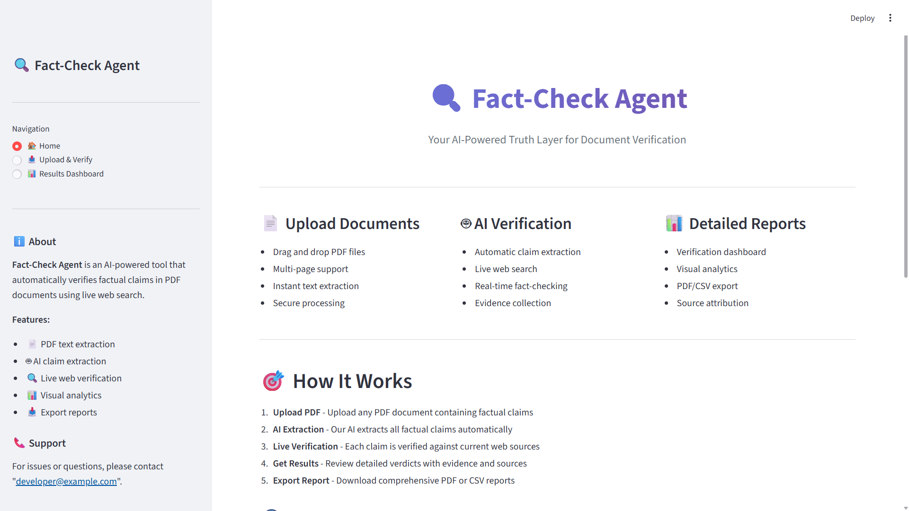
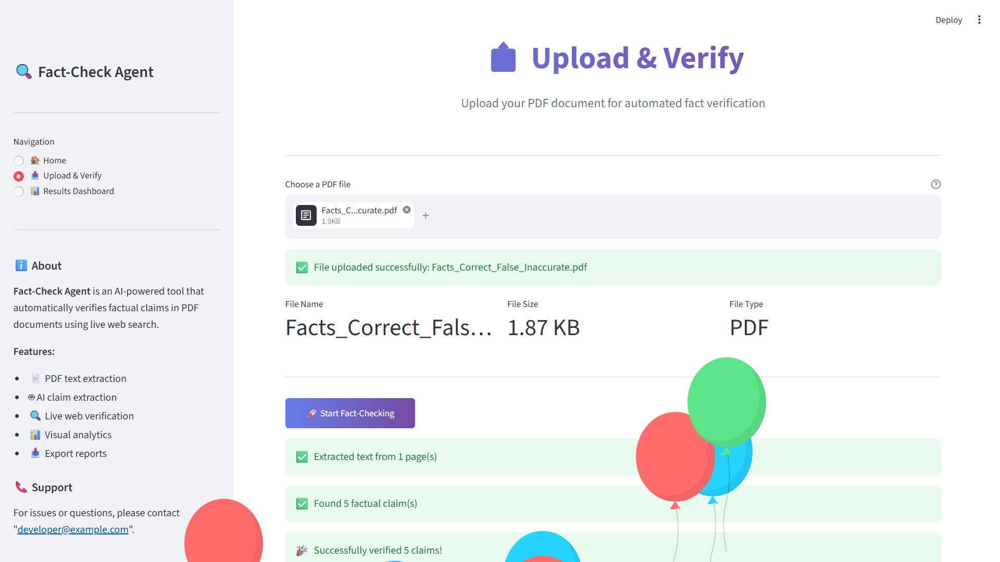
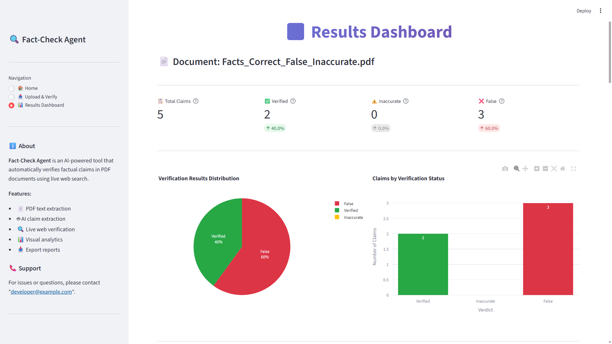

# 🔍 Fact-Check Agent

### AI-Powered Truth Layer for PDF Documents

 

> **Upload a PDF. AI extracts every factual claim. Live web search verifies each one.
> Get a full truth report in seconds.**

 

 

[🚀 Live Demo](#-live-demo) •
[✨ Features](#-features) •
[🖼️ Screenshots](#️-screenshots) •
[⚙️ Installation](#️-installation) •
[🔑 API Keys](#-api-keys-setup) •
[🏗️ Architecture](#️-architecture) •
[🚢 Deployment](#-deployment) •
[📖 Usage Guide](#-usage-guide)

---

## 📌 Table of Contents

- [Project Overview](#-project-overview)
- [Live Demo](#-live-demo)
- [Features](#-features)
- [Screenshots](#️-screenshots)
- [Tech Stack](#-tech-stack)
- [Project Structure](#-project-structure)
- [Architecture](#️-architecture)
- [Installation](#️-installation)
- [API Keys Setup](#-api-keys-setup)
- [Configuration](#-configuration)
- [Usage Guide](#-usage-guide)
- [How It Works](#-how-it-works)
- [Verdict System](#-verdict-system)
- [Export Options](#-export-options)
- [Deployment](#-deployment)
- [Environment Variables](#-environment-variables)
- [Error Handling](#-error-handling)
- [Performance](#-performance)
- [Security](#-security)
- [Roadmap](#-roadmap)
- [Contributing](#-contributing)
- [License](#-license)
- [Author](#-author)

---

## 📋 Project Overview

**Fact-Check Agent** is a production-ready, AI-powered web application that acts as a **truth layer** for PDF documents. Built for the modern information age, it automatically reads uploaded documents, extracts every verifiable factual claim, cross-references them against live internet data, and produces a comprehensive verification report — all within seconds.

### 🎯 What Problem Does It Solve?

In a world flooded with reports, whitepapers, presentations, and research papers, **false statistics, outdated numbers, and fabricated claims** are increasingly common. Manually fact-checking a 20-page document can take hours and requires significant research skill.

Fact-Check Agent automates this entirely:

| Without Fact-Check Agent | With Fact-Check Agent |
|--------------------------|----------------------|
| Hours of manual research | Seconds of automated analysis |
| Missed outdated statistics | Every number verified against live web |
| No structured report | Downloadable PDF + CSV report |
| Subjective judgment | AI + evidence-based verdicts |
| No source tracking | Full source URLs included |

### 🏆 Built For

This application was developed as part of a **Product Management Trainee technical assessment** to demonstrate:

- Full-stack AI application development
- Real-world API integration
- Production deployment capability
- Clean software architecture
- User-centric product thinking

---

## 🚀 Live Demo

> 🌐 **[Click Here to Try the Live App](https://your-app-name.streamlit.app)**

*(Replace the link above with your actual Streamlit Cloud deployment URL after deploying)*

**Test the app instantly with this sample scenario:**

Upload a PDF containing claims like:
- *"Apple's revenue exceeded $10 trillion in 2023"* → Will be flagged **FALSE** ❌
- *"India's population is 1.30 billion"* → Will be flagged **INACCURATE** ⚠️
- *"OpenAI was founded in 2015"* → Will be flagged **VERIFIED** ✅

---

## ✨ Features

### 📄 Document Processing
- **Drag-and-drop PDF upload** with instant file validation
- **First-page visual preview** rendered directly in the browser
- **Multi-page PDF support** — processes every page efficiently
- **Text snippet viewer** before analysis begins
- **File size protection** — enforces 50 MB maximum
- **Corrupt PDF detection** with user-friendly error messages

### 🤖 AI-Powered Claim Extraction
- **GPT-4o-mini LLM** automatically identifies factual claims
- Detects **5 categories** of claims:
  - 🔢 **Numerical** — revenue, population, counts, measurements
  - 📊 **Percentage** — growth rates, market share, conversion rates
  - 📅 **Date** — founding dates, historical events, deadlines
  - 💰 **Financial** — valuations, annual revenue, profit/loss figures
  - ⚙️ **Technical** — product specifications, performance metrics
- Returns structured JSON with claim text, type, and page number
- **Parallel extraction** across all pages simultaneously
- Handles PDFs up to 50 pages efficiently

### 🌐 Live Web Verification
- **Real-time web search** via Tavily API (primary) and Serper API (fallback)
- Collects up to **5 live sources** per claim
- Extracts **supporting snippets** as direct evidence
- **In-memory caching** prevents duplicate search calls
- Async concurrent verification for maximum speed

### 🏛️ AI Reasoning Engine
- **GPT-4o-mini** evaluates each claim against collected evidence
- Generates a **2–4 line human-readable explanation** per verdict
- Provides a **confidence score** (0–100%) per claim
- Suggests a **corrected fact** for inaccurate claims
- Lists **up to 3 source URLs** per verdict

### 📊 Interactive Dashboard
- Real-time **metrics bar** showing totals for each verdict
- **Bar chart** comparing verdict distribution
- **Pie chart** showing percentage breakdown
- **Filter by verdict** to focus on specific result types
- Expandable evidence panels per claim

### 📤 Export & Reporting
- **Styled PDF report** with executive summary, full findings, and sources
- **CSV spreadsheet** with all structured data for further analysis
- Timestamped filenames for organized archiving

### 🔒 Security & Reliability
- File type enforcement (PDF only)
- Input sanitization on all user-provided data
- API keys stored exclusively in environment variables
- Graceful error handling at every processing step

---

## 🖼️ Screenshots

> *(Replace placeholders below with real screenshots after running the app)*

### Home Page

### Upload Interface

### Verification Results Dashboard

### Download Report Page
![Download Page]  (report/fact_check_report_20260613_203312.pdf)

---

## 🛠️ Tech Stack

| Layer | Technology | Purpose |
|-------|-----------|---------|
| **Frontend** | Streamlit 1.32+ | UI framework, navigation, state management |
| **PDF Processing** | PyMuPDF (fitz) | Text extraction, page rendering |
| **AI / LLM** | OpenAI GPT-4o-mini | Claim extraction + verdict reasoning |
| **Primary Search** | Tavily API | Live web search with answer synthesis |
| **Fallback Search** | Serper API | Google search fallback |
| **Async Runtime** | asyncio + aiohttp | Parallel HTTP calls, concurrent verification |
| **Data Visualization** | Plotly + Pandas | Interactive charts and data frames |
| **PDF Export** | fpdf2 | Styled PDF report generation |
| **Env Management** | python-dotenv | Local development secret management |
| **Deployment** | Streamlit Cloud | Production hosting |

---

## 📁 Project Structure

fact-check-agent/
│
├── app.py # 🏠 Main Streamlit application entry point
│ # Contains all UI views and page routing
│
├── requirements.txt # 📦 All Python dependencies with version pins
├── README.md # 📖 This file
├── .env.example # 🔑 Template for environment variables
│
├── utils/ # 🔧 Backend logic modules
│ │
│ ├── init.py # Package marker
│ │
│ ├── pdf_reader.py # 📄 PDF processing
│ │ # • extract_text_from_pdf() — multi-page text
│ │ # • render_first_page() — thumbnail generation
│ │
│ ├── claim_extractor.py # 🤖 AI claim detection
│ │ # • extract_from_page() — LLM per-page call
│ │ # • extract_all_claims() — async orchestrator
│ │
│ ├── search_engine.py # 🌐 Live web search
│ │ # • tavily_search() — primary provider
│ │ # • serper_search() — fallback provider
│ │ # • search_evidence() — cache-aware dispatcher
│ │
│ ├── verifier.py # ✅ Verdict generation
│ │ # • verify_single_claim() — search + LLM reason
│ │ # • verify_claims() — async batch processor
│ │
│ ├── report_generator.py # 📊 Export engines
│ │ # • generate_pdf() — styled PDF report
│ │ # • generate_csv() — structured CSV export
│ │
│ └── helpers.py # 🔨 Shared utilities
│ # • sanitize_filename()
│ # • truncate_text()
│ # • get_file_hash()
│
├── assets/ # 🖼️ Static assets (images, icons)
├── uploads/ # 📤 Temporary upload storage
└── reports/ # 📋 Generated report storage
